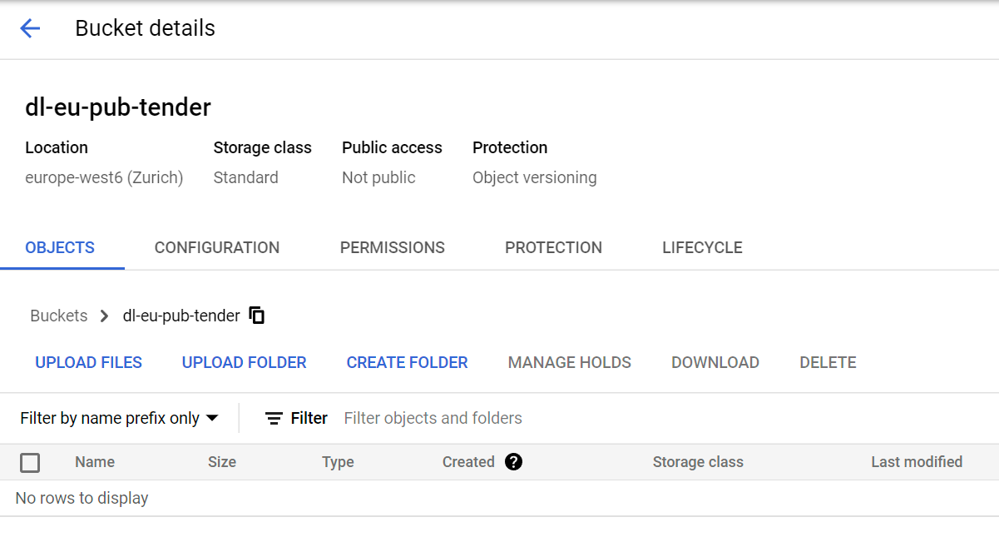
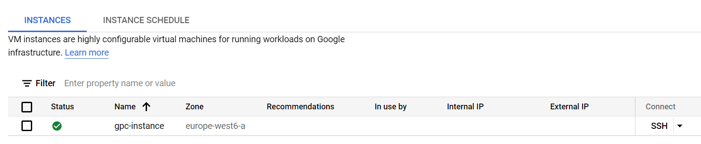

## Initial setup
## GCP initial setup
To enable cloud development I have created a project in Google Cloud also, enabled Compute Engine API which is needed to enable VM creation.

## Terraform IoC
For thi sparticular project, I will setup cloudf infrastructure on Google Cloud platfrom.
To set it up I will use Terrraform IaC tool. For this purpose two files are created:
 - main.tf: the main configuration file
 - variables.tf: file containing project variables, like project, virtual machine attributes

I run:
```
terraform init
terraform plan
terraform apply
```
from a CLI and VM as well as data lake bucket is created.





## Confuguring virtual machine
I am connecting to virtual machine via VS codes SSH terminal: I have created ssh keys with a following command from [GCP documentation](https://cloud.google.com/compute/docs/connect/create-ssh-keys#windows-10-or-later) and placed in .ssh directory.

```
ssh-keygen -t rsa -f gcp -C valdas -b 2048
```
To make a connection public key need to be placed to Google console Metadata / SSH keys page (documentation [here](https://cloud.google.com/compute/docs/connect/add-ssh-keys)). 

### Install Anaconda
While connected to VM:

```
wget https://repo.anaconda.com/archive/Anaconda3-2021.11-Linux-x86_64.sh
```

then, in order to install Anaconda:

```
bash Anaconda3-2021.11-Linux-x86_64.sh
```

remove file after instalation:

```
rm Anaconda3-2021.11-Linux-x86_64.sh
```

### Install docker and docker-compose

```
sudo apt-get update # fetch list of packages
sudo apt-get install docker.io

sudo groupadd docker # Run docker without sudo
sudo gpasswd -a $USER docker
sudo service docker restart
newgrp docker
```

Install docker-compose:

```
mkdir bin
cd bin
wget https://github.com/docker/compose/releases/download/v2.4.1/docker-compose-linux-x86_64 -O docker-compose
chmod +x docker-compose # Make it executable
```
I also add bin directory to $PATH variable in .bashrc:

```
export PATH="${HOME}/bin:${PATH}"
source .bashrc
```

### Install Apache Spark for batch processing of data
Java is needed to run Spark:

```
mkdir spark
cd spark

wget https://download.java.net/java/GA/jdk11/9/GPL/openjdk-11.0.2_linux-x64_bin.tar.gz
tar xzfv openjdk-11.0.2_linux-x64_bin.tar.gz

rm openjdk-11.0.2_linux-x64_bin.tar.gz

export JAVA_HOME="${HOME}/spark/jdk-11.0.2"
export PATH="${JAVA_HOME}/bin:${PATH}"
```

Download and install Spark:
```
wget https://dlcdn.apache.org/spark/spark-3.0.3/spark-3.0.3-bin-hadoop3.2.tgz
tar xzfv spark-3.0.3-bin-hadoop3.2.tgz
rm spark-3.0.3-bin-hadoop3.2.tgz

export SPARK_HOME="${HOME}/spark/spark-3.0.3-bin-hadoop3.2"
export PATH="${SPARK_HOME}/bin:${PATH}"
```
After instalation, I check if it succeded by checking versions:
```
java --version
spark-shell
```
