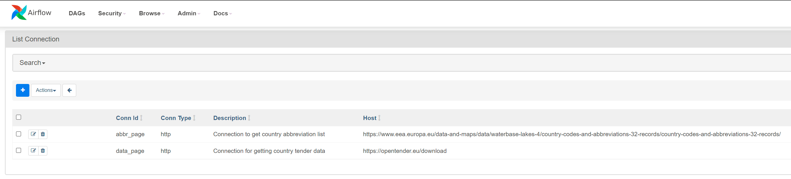
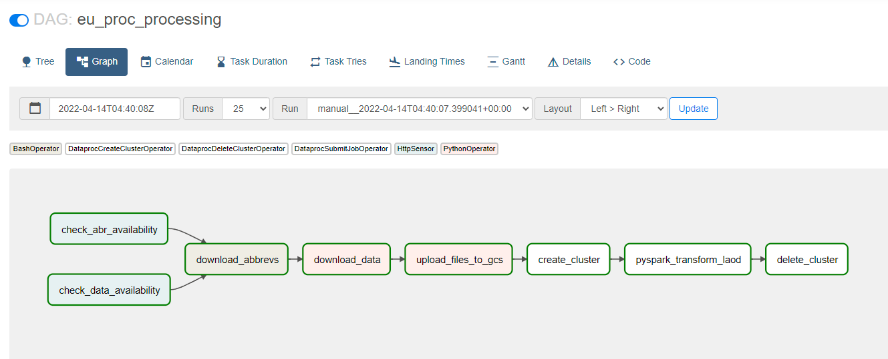

## Pipeline structure and notes
Data is located at [opentender.eu](https://opentender.eu/download).
It is divided per country by year in a zipped file with a structure:
'https://opentender.eu/data/files/data-{country_abbreviation_lower}-csv.zip', where {country_abbreviation_lower} is a country name abbreviation in lower case, ex. es for Spain, lv for Latvia, etc.

To get abbreviations I will use country list for [europa.eu](https://www.eea.europa.eu/data-and-maps/data/waterbase-lakes-4/country-codes-and-abbreviations-32-records/country-codes-and-abbreviations-32-records/at_download/file).


Pipeline step by step:

1. Check if websites are available using sensor operator
    Use a HttpSensor and add connectors to Airflow configuration:
    ```
    check_abr_availability = HttpSensor (
        task_id = 'check_abr_availability',
        http_conn_id = 'abbr_page',
        endpoint = '/at_download/file'
        )
    
    check_data_availability = HttpSensor (
        task_id = 'check_data_availability',
        http_conn_id = 'data_page',
        endpoint = '/'
        )
    ```
    Also, when using HTTP sensor conncetions need to be set in Airflow Web UI under Admin/ Connections:
    

2. Download abbreviation list and parametrise downlowds of country data:

    Make sure, users / owners are the same for Airflow directory, othrevise:
    ```
    sudo chown -R [user] airflow
    ```
    I have used Python script to generate file names with Pandas data frame, loop through data and upload it to Google Data lake:
    ```
    def create_data_links():
    df_country_abrvs = pd.read_csv(f'{AIRFLOW_HOME}/data/countries_abr.csv', index_col='ISO2')
       
    for index, row in df_country_abrvs.iterrows():
        # Define target url
        TARGET_URL = f'https://opentender.eu/data/files/data-{index.lower()}-csv.zip'              
        
        #  Save to path
        
        r = requests.get(TARGET_URL)
        if r.ok:
            LOCAL_CSV_DIR = AIRFLOW_HOME + '/data/country_data/' + index.lower()
            if not os.path.exists(f'{LOCAL_CSV_DIR}'):
            # Create folder if it does not exist
                os.makedirs(LOCAL_CSV_DIR)  
            filename = f'{index}.zip'  
            file_path = os.path.join(LOCAL_CSV_DIR, filename)  
                           
            print("saving to", os.path.abspath(file_path))
            with open(file_path, 'wb') as f:
                f.write(r.content)
                    
            # Unzip
            print(f'Extracting...  {filename}')
            with ZipFile(f'{LOCAL_CSV_DIR}/{index}.zip', 'r') as zipObj:
                    zipObj.extractall(f'{LOCAL_CSV_DIR}')
            # Remove zip file
            os.remove(f'{LOCAL_CSV_DIR}/{index}.zip')
    ```

3. I use Python function to upload data to Google Cloud storage:

    ```
    def upload_to_gcs(local_path: str, bucket: str, gcs_path: str):
    GCS_CLIENT = storage.Client()
    rel_paths = glob.glob(local_path +'/**', recursive=True)
    bucket = GCS_CLIENT.get_bucket(bucket)
    for local_file in rel_paths:

        remote_path = f'{gcs_path}/{"/".join(local_file.split(os.sep)[1:])}'
        
        if os.path.isfile(local_file):
            blob = bucket.blob(remote_path)
            blob.upload_from_filename(local_file)
    ```

4. Start Dataproc cluster with dataproc operator
    ```
    create_cluster = DataprocCreateClusterOperator(
        task_id="create_cluster",
        project_id=PROJECT_ID,
        cluster_config=CLUSTER_CONFIG,
        region=REGION,
        cluster_name=CLUSTER_NAME,
    ```
5. Make transformations and upload data to Big Query with [Spark](./code/spark_to_bq.py). I use Jupyter to work with Spark and convert Jupyter NoteBook to Python script for running it on Dataproc.
   This aproach to this is not the most optimal one as this task could be separated into transformation and load. In acurrent stage, if load fails, all the transformations need to run again, even they have performed well.
   
   I have used Airflow [documentation](https://github.com/GoogleCloudDataproc/spark-bigquery-connector) and conncetor [documentation](https://github.com/GoogleCloudDataproc/spark-bigquery-connector)

   Note: important, do not forget to add jar file location with corrcet Scala version to your dag:

   ```
   PYSPARK_JOB = {
    "reference": {"project_id": PROJECT_ID},
    "placement": {"cluster_name": CLUSTER_NAME},
    "pyspark_job": {
        "main_python_file_uri": PYSPARK_URI,
        "jar_file_uris": ["gs://spark-lib/bigquery/spark-bigquery-with-dependencies_2.12-0.24.2.jar"]
    },
    }
   ```

6. Delete Dataproc cluster with dataproc operator:
    ```    
    delete_cluster = DataprocDeleteClusterOperator(
        task_id="delete_cluster", 
        project_id=PROJECT_ID, 
        cluster_name=CLUSTER_NAME, 
        region=REGION
    )   
    ```

Finally, pipeline is triggered:




   